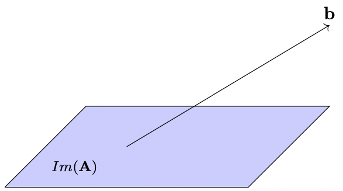

---
jupytext:
  formats: md:myst
  text_representation:
    extension: .md
    format_name: myst
kernelspec:
  display_name: Python 3
  language: python
  name: python3
---
# Systèmes d'équations linéaires
```{index} Système linéaire
```
Les systèmes linéaires interviennent dans de nombreux contextes
d'applications (physique, mécanique, sciences du vivant, chimie,
économie,\...).

Un système linéaire s'écrit d'une manière générale sous la forme
${\bf A}{\bf x}={\bf b}$ où
${\bf A}\in \mathcal{M}_{m,n}(\mathbb{R})$, ${\bf x}\in \mathbb R^n$ et
${\bf b}\in \mathbb R^m$. ${\bf A}$ est donnée, ${\bf b}$ est le second
membre également donné, et il s'agit de trouver s'il existe un (ou des)
vecteur(s) ${\bf x}$ satisfaisant l'équation : il faut donc résoudre le
système linéaire.

````{prf:definition} Système singulier
```{index} Système linéaire ; singulier
```
On dira que le système est singulier s'il n'a pas de
solution ou s'il a une infinité de solutions.
````

## Représentations des systèmes d'équations linéaires

Considérons le système de 2 équations à 2 inconnues $\begin{aligned}
2x_1-x_2&=&1\label{explsl1}\\
x_1+x_2&=&5 \label{explsl2}\end{aligned}$


```{margin} 

```
- *Première interprétation (lecture par ligne).* Chaque équation
représente une droite de $\mathbb R^2$. La solution se trouve à
l'intersection des deux droites (à moins qu'elles ne soient parallèles).
On obtient ici le point $x_1=2$, $x_2=3$, c'est-à-dire le vecteur
$x=\left(\begin{array}{c}2\\ 3\end{array}\right)$ de $\mathbb R^2$ .


```{margin} 

```
- *Deuxième interprétation (lecture par colonne).* On écrit le
système sous la forme vectorielle
$x_1\left(\begin{array}{c}2\\ 1\end{array}\right)
+x_2\left(\begin{array}{c}-1\\ 1\end{array}\right)=
\left(\begin{array}{c}1\\ 5\end{array}\right).$ ou
$x_1{\bf u} + x_2{\bf v} ={\bf z}$. Il
faut donc trouver les coefficients d'une combinaison linéaire de deux
vecteurs qui donnent un troisième.


Si ${\bf A} = \begin{pmatrix}
2&-1\\1&1
\end{pmatrix}$, il s'agit donc de trouver si ${\bf y} = \begin{pmatrix}
1\\5
\end{pmatrix}$ peut s'écrire comme combinaison linéaire des colonnes de
${\bf A}$, et donc de savoir si ${\bf y}\in {Im(\bf A})$.

## Systèmes d'équations linéaires homogènes

````{prf:definition} Système homogène 
```{index} Système linéaire ; homogène
```
Un système d'équations linéaires est dit homogène si le
second membre est nul.
````

Soit ${\bf A}\in \mathcal{M}_{m,n}(\mathbb{R})$ la matrice du système
${\bf A}{\bf x}={\bf b}$. Analysons l'ensemble des solutions du système
d'équations linéaires homogène
${\bf A}{\bf x}={\bf 0}$. Il est clair que ${\bf 0}$
est toujours solution.

````{prf:definition} Noyau d'une matrice 
```{index} Noyau
```
```{index} Matrice ; noyau
```
L'ensemble des solutions du système linéaire est un sous-espace vectoriel de $\mathbb R^n$. Ce
sous-espace est appelé noyau de ${\bf A}$, noté $Ker({\bf A})$.
````

En effet, si ${\bf x}$ et ${\bf y}$ sont solutions de
${\bf A}{\bf x}={\bf 0}$, ${\bf x}+{\bf y}$ est aussi solution, ainsi
que $\lambda {\bf x}$, $\lambda\in\mathbb R$.

`On s'aperçoit alors que tout  peut être représenté de deux manières
distinctes` :

-   `comme ensemble de combinaisons linéaires d'un nombre fini de
    vecteurs (espace des vecteurs colonnes ou image de la matrice formée
    par ces colonnes)` :
    ${\bf y}=\displaystyle\sum_{j=1}^nx_jA_{\bullet j}$

-   `comme ensemble des solutions d'un système linéaire homogène (noyau
    de la matrice dont les lignes contiennent les coefficients des
    équations)` :
    $(\forall i\in [\![ 1,m]\!])A_{i\bullet}^\top x = 0$


```{margin} 

```
````{prf:property}  Sous-espaces supplémentaires d'une matrice 
```{index} Sous-espace ; supplémentaire
```

Soit
${\bf A}\in \mathcal{M}_{m,n}(\mathbb{R})$. On a :

$\begin{aligned}
&& Ker({\bf A})\perp Im({\bf A^\top} ),\quad\mbox{dans}\ \mathbb R^n\\
&& Ker({\bf A^\top} )\perp Im({\bf A}),\quad\mbox{dans}\ \mathbb R^m.\end{aligned}$

et les sous-espaces sont supplémentaires.
````


Les dimensions respectives de ces quatre sous-espaces ne dépendent que
du rang de ${\bf A}$. $\begin{aligned}
&&dim Ker({\bf A})=n-rang({\bf A}),\ dim Im({\bf A^\top} )=rang({\bf A}),\quad\mbox{dans}\ \mathbb R^n\\
&&dim Ker({\bf A^\top} )=m-rang({\bf A}),\ dim Im({\bf A})=rang({\bf A}),\quad\mbox{dans}\ \mathbb R^m\end{aligned}$

Soit la matrice $2\times 2$ suivante
${\bf A}=\left[\begin{array}{rr}1  & -3\\ -2  &  6\end{array}\right].$
On a $rang({\bf A})=1$.

-   L'espace colonnes ou $Im({\bf A})$ contient tous les multiples du
    vecteur $(1\ -2)^\top$.

-   Le noyau de ${\bf A}$ contient les multiples de $(3\ 1)^\top$.

-   L'espace lignes ou $Im({\bf A^\top} )$ contient les multiples de
    $(1\ -3)^\top$.

-   Le noyau de ${\bf A^\top}$ contient les multiples de $(2\ 1)^\top$.

Ces quatre sous-espaces sont des droites de $\mathbb R^2$. Si on change la
deuxième colonne en $\begin{pmatrix}-3& 7\end{pmatrix}^\top$, les
colonnes sont alors linéairement indépendantes et $rang({\bf A})=2$.
Dans ce cas $Im(A)=Im({\bf A^\top} )=\mathbb R^2$ et
$Ker({\bf A})=Ker({\bf A^\top} )=\{0\}$.

## Systèmes d'équations linéaires

Terminons par le problème général de la résolution d'un système linéaire
${\bf A}{\bf x}={\bf b}$ où ${\bf A}\in \mathcal{M}_{m,n}(\mathbb{R})$,
${\bf x}\in \mathbb R^n$ et ${\bf b}\in \mathbb R^m$

On cherche donc à décrire l'ensemble des ${\bf x}\in\mathbb R^n$ solutions
du système. Avant de nous poser le problème de l'existence d'une
solution, montrons que l'ensemble des solutions, quand il n'est pas
vide, est un objet de $\mathbb R^n$ d'aspect familier. Soit ${\bf x^0}$ une
solution particulière du système
${\bf A}{\bf x}={\bf b}$. Alors, toute solution du système peut s'écrire
sous la forme ${\bf x}={\bf x^0}+{\bf y}$, ${\bf y}\in Ker({\bf A})$. En
effet comme ${\bf x}$ et ${\bf x^0}$ sont deux solutions du système, on
a ${\bf A}({\bf x}-{\bf x^0})={\bf 0}$. Donc, l'ensemble des solutions
s'obtient par une translation du sous--espace noyau de ${\bf A}$. Il en
a donc la forme géométrique et quand ${\bf y}$ varie, on construit une
famille d'objets linéaires parallèles entre eux. 
```{margin} 

```
On les
appelle des *variétés linéaires* ou *sous-espaces affines*. Si une
variété linéaire passe par l'origine, c'est un sous-espace vectoriel.

Bien que la dimension ait été définie pour décrire la génération d'un
sous--espace vectoriel, on l'emploie pour une variété linéaire par
analogie pour exprimer le nombre de degrés de liberté. Si
$V=\{{\bf x}\in\mathbb R^n\mid {\bf A}{\bf x}={\bf y}\}$ est une variété
linéaire (donc que l'ensemble des solutions du système est non vide)
telle que $V=\{{\bf x^0}\}+Ker({\bf A})$, on définit sa dimension comme
$\dim V=dim Ker({\bf A})=n-rang({\bf A}).$ Si un système homogène a
toujours une solution (l'origine), ce n'est pas vrai pour le cas
général.

```{margin} 

```
```` {prf:theorem} Existence d'une solution 
Le système linéaire
${\bf A}{\bf x}={\bf b}$ possède au moins une solution si, et seulement
si, ${\bf b}\in Im({\bf A})$.\
Dans le cas contraire, on dit que le système est incompatible.
````


On remarque que cette condition s'exprime dans l'espace des colonnes
$\mathbb R^m$. On sait déjà que le sous--espace $Im({\bf A})$ est de
dimension $rang({\bf A})$. On en déduit que si $rang({\bf A})<m$, la
probabilité pour que ${\bf b}$ soit dans $Im({\bf A})$ est nulle et le
système sera presque toujours sans solution.

Par contre si $rang({\bf A})=m$, on dit que ${\bf A}$ est de rang
plein, le système a donc toujours des solutions. Si de plus, $m=n$, le
noyau de ${\bf A}$ est de dimension nulle et le système a une solution
unique. Cette solution est l'image de ${\bf b}$ par la transformation
inverse de ${\bf A}$, *i.e.* 
${\bf x}={\bf A^{-1}}{\bf b}.$ 
Donc
seules les matrices carrées de rang plein sont inversibles. On dit aussi
que ces transformations sont *régulières*. Les matrices carrées non
inversibles sont associées aux transformations *singulières* de
$\mathbb R^n$.

```{prf:remark}
:class: dropdown
Une condition équivalente, nécessaire et suffisante, pour que le système
ait une solution est :
$rang({\bf A})=rang\left([{\bf A}\,|\,{\bf b}]\right),\label{SL_CNS1}$
où $[{\bf A}\,|\,{\bf b}] \in \mathcal{M}_{m,n+1}(\mathbb{R})$ est la
matrice obtenue en rajoutant la colonne ${\bf b}$ à ${\bf A}$. On verra
de toute façon qu'il est rare que l'on ait à calculer explicitement
l'inverse d'une matrice et que la résolution itérative d'un système
linéaire permet de tester la condition
précédente
comme elle permet de calculer le rang de ${\bf A}$.
```

## Condition d'une matrice
Etudions les variations de la solution d'un système d'équations linéaires quand le second membre subit une perturbation : 


${\bf Ax}={\bf b} \Rightarrow {\bf A(x+\bf \delta x)}={\bf b+\bf \delta\bf b}
$

On peut donc écrire $\bf \delta x={\bf A^{-1}\bf \delta \bf  b}$ d'où les relations écrites avec des normes subordonnées appropriées :

$\|\bf\delta \bf x\|\leq\|\bf A^{-1}\|\|\bf \delta \bf b\|$

$\|\bf A\|\|\bf x\|\geq\|\bf b\|$

et on peut écrire l'estimation de l'erreur relative en norme sur $\bf x$ en fonction de la perturbation relative sur ${\bf b}$ :

$\frac{\|\bf\delta \bf x\|}{\|\bf x}\|\leq \|\bf A\|\|\bf A^{-1}\|\frac{\|\bf \delta \bf b\|}{\|\bf b\|}$

````{prf:definition} Condition d'une matrice
La quantité $\|{\bf A}\|\|{\bf A^{-1}}\|$ est appelée la condition de la matrice est notée $\sigma({\bf A})$.
````
```{index} Condition
```

On peut démontrer de même que si ${\bf A}$ est sujette à une erreur ${\bf \delta \bf A}$ alors 

$
{\bf Ax}={\bf b} \Rightarrow ({\bf A + {\bf \delta {\bf A}})(x+\bf \delta x)}={\bf b}
$
et 

$\frac{\|{\bf\delta \bf x}\|}{\|{\bf x}+{\bf \delta \bf x}\|}\leq \sigma({\bf A})\frac{\|{\bf \delta {\bf A}}\|}{\|{\bf A}\|}$

et on peut même majorer l'erreur relative dans le cas où l'on commet à la fois une erreur sur ${\bf A}$ et une erreur sur ${\bf b}$ : 

````{prf:theorem} Majoration de l'erreur dans le cas  $({ A + { \delta { A}})( x+\delta x)}={ b+\delta b}$

Soient ${\bf A}\in\mathcal{M}_n(\mathbb R)$ inversible, ${\bf b}\in(\mathbb R^n)^*$, ${\bf \delta \bf  A}\in\mathcal{M}_n(\mathbb R)$ et ${\bf \delta \bf b}\in\mathbb R^n$. On suppose que $\|\bf \delta \bf A\|<\frac{1}{\|{\bf A^{-1}}\|}$. 

Alors la matrice $(\bf A + {\bf \delta {\bf A}})$ est inversible et si ${\bf x}$ est solution de ${\bf Ax} = {\bf b}$ et $(\bf x+\bf \delta x)$ est solution de $({\bf A + {\bf \delta {\bf A}})(\bf x+\bf \delta x)}={\bf b+\bf \delta b}$, alors 

$\frac{\|{\bf \delta \bf x}\|}{\|{\bf x}\|}\leq\frac{\sigma(\bf A)}{1-\|{\bf A^{-1}}\|\|{\bf \delta \bf A}}\|\left (\frac{\|{\bf \delta \bf b}\|}{\|{\bf b}\|} +\frac{\|{\bf \delta {\bf A}}\|}{\|{\bf A}\|}\right )$
````


